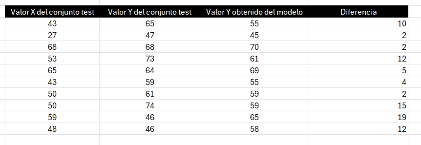

## Taller estudio de caso jugadores de futbol

# 1) Carga de datos


```{r message=FALSE}
library("dplyr")
library(ggplot2)
library(lmtest)
library(car)

baseDatos <- read.csv("D:/Documentos/RStudio Files/RCodesUnal/WORKSHOPS/EstudioDeCasoFutbol/players_15.csv")

baseDatos <- select(baseDatos, -release_clause_eur, -nation_jersey_number, -gk_kicking,
                    -gk_positioning, -gk_diving, -gk_reflexes, -gk_handling, -gk_speed, 
                    -mentality_composure)

baseDatos <- baseDatos[!is.na(baseDatos$shooting), ]
```

Se cargaron los datos de la base de datos. Además de esto se eliminaron las columnas que tenian todos o la mayoria de datos como NA. Por otro lado, se revisaron las variables shooting, dribbling, pace, passing, defending y se encontró que los porteros no tenían información en estos campos. Se procedió a eliminar a los porteros del análisis estadistico.

Las variables 'club’, 'preferred_foot', 'team_position', 'age', ‘height_cm', 'weight_kg', 'overall','potential','value_eur','wage_eur','shooting','passing', 'dribbling', 'defending', 'physic','pace' son campos que representan información valiosa acerca de los jugadores a analizar. Por ejemplo, club, preferred_foot y team_position son datos character y el resto de estas variables son numeric.

# 2) Exploración de variables shooting y dribbling

```{r}

## Analisis Variable Shooting
ggplot(baseDatos, aes(x = shooting)) +
  geom_histogram(binwidth = 5, boundary = 0, fill = "#CD8C95", color = "black") +
  scale_x_continuous(
    name = "Shooting score",
    breaks = seq(0, ceiling(max(baseDatos$shooting) / 10) * 10, by = 10)
  ) +
  ylab("Frecuencia") +
  ggtitle("Histograma de shooting") +
  theme_bw()

boxplot(baseDatos$shooting, horizontal = TRUE, 
        xlab = "Shooting score", col = "#8B5F65",
        main = "Diagrama de Boxplot variable Shooting")

## Analisis Variable Dribbling
ggplot(baseDatos, aes(x = dribbling)) +
  geom_histogram(binwidth = 5, boundary = 0, fill = "#87CEFA", color = "black") +
  scale_x_continuous(
    name = "Dribbling score",
    breaks = seq(0, ceiling(max(baseDatos$shooting) / 10) * 10, by = 10)
  ) +
  ylab("Frecuencia") +
  ggtitle("Histograma de dribbling") +
  theme_bw()

boxplot(baseDatos$dribbling, horizontal = TRUE, 
        xlab = "Dribbling score", col = "#87CEFA",
        main = "Diagrama de Boxplot variable Dribbling")
```

# 3) Regresión lineal simple

```{r}
# Muestra principal de 140 elementos
set.seed(10)
indices_muestra <- sample(nrow(baseDatos), 140)
muestra <- baseDatos[indices_muestra, ]

# Ahora sacamos los 10 datos solo de los que no fueron seleccionados antes
set.seed(7)
restantes <- setdiff(1:nrow(baseDatos), indices_muestra)
indices_test <- sample(restantes, 10)
test <- baseDatos[indices_test, ]

```

Se establece la muestra de 140 elementos con semilla 10. Además se crea otra muestra llamada test de 10 datos aleatorios con semilla 7 y que no esten incluidos dentro de la otra muestra.

Ahora, analizaremos la muestra tomada de 140 datos y se estudiará si pasa todas las pruebas para ser un modelo confiable, haciendo test de linealidad, correlacion, mocedasticidad y normalidad de los residuos o errores.

## a) Gráfico de disperción y Correlación

```{r}
# a)
plot(muestra$shooting, muestra$dribbling, col = "blue4",
     xlab = "Shooting score", ylab = "Dribbling score", 
     main = "Gráfico de disperción Shooting vs Dribbling", pch = 19)
cor(muestra$shooting, muestra$dribblin)
```
## b) Coeficientes
```{r}
# b)
modelo <- lm(dribbling ~ shooting, muestra)
modelo$coefficients
```

En este caso es 28.0275225 es el intecepto con el eje y de la recta y 0.6238631 se refiere a la pendiente de la misma. Como se puede ver ninguno de los dos valores es 0.

## c) Prueba de hipotesis
```{r}
# c)
summary(modelo) # La hipotesis nula se rechaza, por lo tanto, 
```

Shooting está linealmente relacionado con dribbling y el coeficiente B1 es != 0.

## d) Prueba ANOVA 
```{r}
# d)
anova(modelo) 
```
La hipotesis nula de que el modelo SIN shooting es tan bueno como el modelo CON shooting, se rechaza debido a p -value, por lo tanto, el modelo con shooting es significativamente mejor.
Por otro lado, se puede evidenciar que el coeficiente de determinación es 0.5747.

## f) Analisis de residuos
```{r}
# f)
plot(modelo$residuals, col = "green4")
dwtest(modelo)

hist(modelo$residuals, col = "steelblue")

bptest(modelo)

plot(modelo, 1, main = "Análisis de Linealidad", col = "green4", pch = 10)
```

- Los residuos son independientes y no se encuentran correlacionados.
- Los residuos son normales como se representa en el histograma de residuos.
- Los residuos tienen varianza constante, es decir, existe homocedasticidad.
- Los residuos presentan linealidad ya que en el gráfico están distribuidos aleatoriamente.

# Valores atípicos o influyentes

```{r}
# g)
par(mar = c(5, 5, 4, 2))
influenceIndexPlot(modelo, vars="Bonf", las=1, col = "darkblue",
                   main = "Valores atípicos (Bonferroni p-value)",
                   las = 1, ylim = c(0, 1))
par(mar = c(5, 6, 4, 2))
influenceIndexPlot(modelo, vars="Cook", col = "darkred",
                   main = "Observaciones Influyentes (Cook's Distance)",
                   las = 1, ylim = c(0, 0.1))
```

Se encuentra un dato atípico, el 7790. Para revisar si este dato es influyente sobre el modelo hay que realizar otra prueba, utilizando la distancia de Cook. Este gráfico nos dirá si es necesario eliminar este dato y volver a realizar el estudio si resulta ser mayor a 1. Sin embargo, como se puede evidenciar en la gráfica, ningun valor se acerca a 1, es por ello que podemos continuar con nuestro modelo.

## h) Gráfica de intervalos de confianza

```{r}
# h)
nuevos_datos <- data.frame(shooting = seq(min(muestra$shooting), 
                                          max(muestra$shooting), length.out = 100))
pred_conf <- predict(modelo, newdata = nuevos_datos, interval = "confidence", level = 0.95)
pred_pred <- predict(modelo, newdata = nuevos_datos, interval = "prediction", level = c(0.95))

nuevos_datos$fit <- pred_conf[, "fit"]
nuevos_datos$conf_lwr <- pred_conf[, "lwr"]
nuevos_datos$conf_upr <- pred_conf[, "upr"]
nuevos_datos$pred_lwr <- pred_pred[, "lwr"]
nuevos_datos$pred_upr <- pred_pred[, "upr"]

ggplot(muestra, aes(x=shooting, y=dribbling)) +
  geom_point() +
  geom_smooth(method = 'lm', formula = y~x, se=FALSE, col = 'blue') +
  geom_ribbon(data = nuevos_datos, aes(x = shooting, ymin = conf_lwr, ymax = conf_upr),
              fill = 'orchid4', alpha = 0.2, inherit.aes = FALSE) +  
  geom_ribbon(data = nuevos_datos, aes(x = shooting, ymin = pred_lwr, ymax = pred_upr),
              fill = 'red', alpha = 0.1, inherit.aes = FALSE) +
  theme_bw()

```

## i) Base Test y datos de predicción

```{r}
#i)

predict(modelo, newdata = data.frame(shooting = 43), interval = "prediction", level = 0.95)
predict(modelo, newdata = data.frame(shooting = 27), interval = "prediction", level = 0.95)
predict(modelo, newdata = data.frame(shooting = 68), interval = "prediction", level = 0.95)
predict(modelo, newdata = data.frame(shooting = 53), interval = "prediction", level = 0.95)
predict(modelo, newdata = data.frame(shooting = 65), interval = "prediction", level = 0.95)
predict(modelo, newdata = data.frame(shooting = 43), interval = "prediction", level = 0.95)
predict(modelo, newdata = data.frame(shooting = 50), interval = "prediction", level = 0.95)
predict(modelo, newdata = data.frame(shooting = 50), interval = "prediction", level = 0.95)
predict(modelo, newdata = data.frame(shooting = 59), interval = "prediction", level = 0.95)
predict(modelo, newdata = data.frame(shooting = 48), interval = "prediction", level = 0.95)
```


