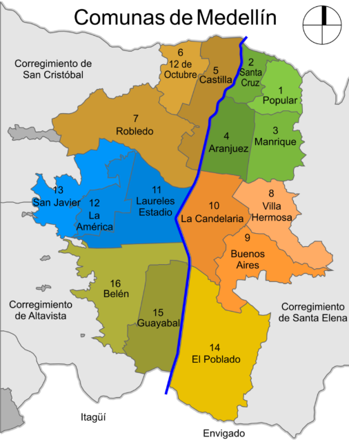

```{r setup, include=FALSE}
knitr::opts_chunk$set(echo = TRUE)
```

## 1. INTRODUCCIÓN

Medellín capital del departamento de Antioquia, Colombia es una de las ciudades principales de nuestro país, con gran desarrollo económico y organización, cuenta con 16 comunas y 5 corregimientos en zona rural. Su población asciende a los 2.945.034 habitantes, dentro de las cuales la comuna 16 es la más poblada al contar con 196.593 habitantes (censo 2019), seguida de la comuna 6 con aproximadamente 195.800 habitantes.

Su ubicación geográfica cuenta con límites de la siguiente manera:
* Comunas al Norte de Medellín: Bello, Copacabana y San Jerónimo
* Comunas al Sur de Medellín: Envigado, Itagui, La Estrella y el Retiro

```{r imagen-ejemplo, echo=FALSE, out.width="300px", out.height="300px", fig.align='center'}

```

Tomado de: https://es.medellin-tours.com/comunas-barrios-medellin/

## CASO PRÁCTICO

Una agencia inmobiliaria en Medellín está interesada en optimizar sus estrategias de marketing y ventas a partir del análisis detallado de las características de los apartamentos y las preferencias de los clientes potenciales.

La agencia ha recopilado un conjunto de datos con información relevante sobre los apartamentos, tales como el precio, área en metros cuadrados, ubicación, estrato, número de alcobas, baños y la presencia de comodidades adicionales como balcón y parqueadero. El análisis de estos datos permitirá a la agencia comprender mejor las tendencias de mercado y adaptar su oferta a las necesidades del cliente.

El objetivo principal de este caso es realizar un análisis exploratorio de los apartamentos en Medellín usando técnicas de análisis y visualización de datos en RStudio, incluyendo medidas de dispersión y posición. Además, poder responder unas preguntas sobre los apartamentos y sus características que implican el uso de probabilidades.

Conjunto de los datos:

  - Precio (en millines de COP)
  
  - Área en metros cuadrados (mt2): Tamaño del apartamento
  
  - Ubicación: Zona o área de la ciudad (por ejemplo norte)
  
  - Estrato socioeconómico: nivel de estrato (2,3,4, etc)
  
  - Alcobas: número de habitaciones
  
  - Baños: número de baños
  
  - Balcón: indicador de si el aprtamrento tiene balcón ("si" o "no")
  
  - Parqueadero: presencia de parqueadero ("si" o "no")
  
  - Administración: coto mensual de la administración como porcentaje del precio
  
  - Avalúo: valor estimado del inm,ueble en millones de COP
  
  - Terminado: inidcad si el apartamento está terminado ("si" o "no")
  

## 2. DESARROLLO DEL EJERCICIO

### EXPLORACIÓN INICIAL DE DATOS

* **Estructura del conjunto de datos:**
  -	Para iniciar, la ubicación de mi archivo la identifico mediante la función getwd(), la cual dispuse en la siguiente ruta y mediante esta función puedo visualizarla:
  "D:/Documentos/RStudioFiles/Workshops/InmobiliarioMedellin"
* **Tamaño:**
  - La cantidad de filas de acuerdo con la función nrow(BaseInmobiliario) corresponde a 694
  - La cantidad de columnas de acuerdo con la función ncol(BaseInmobiliario) corresponde a 12
  - Es decir, BaseInmobiliario contine 694 filas con 12 variables, las cuales pasaremos a analizar con mayor profundidad a continuación:
* **Exploración de datos-funciones:**
  - Head(): Refleja las primeras filas de la base
  - Tail(): Refleja las últimas filas de la base
  - Str(): Refleja el tipo de variable para cada columna
  - Summary():
Refleja las características de cada variable, dato importante para realizar la coerción del tipo de dato de cada variable. Adicionalmente, refleja la cantidad de filas de cada variable
  - Names(): Refleja el nombre de las variables.
  - La BaseInmobiliario cuenta con 12 variables la cuales son las siguientes y, una vez realizada la exploración de datos se identifica que cada variable cuenta con el tipo de adecuado para la interacción de las mismas en nuestro análisis.
* **Datos faltantes:**
  - Una vez aplicada la función sum(is.na(BaseInmobiliario)) No se reflejan campos vacíos en la base
  - Una vez aplicada la función colSums(is.na(BaseInmobiliario)) se confirma que no se cuenta con datos vacío en cada columna
  - En la BaseInmobiliario no tenemos datos NA, confirmado mediante la función colSums(BaseInmobiliario == "NA", na.rm = TRUE). Donde se está indicando que realice el conteo de los datos “NA” (es decir textual dentro de la base) excepto los campos vacíos en caso de tener (porque internamente toma como NA los campos vacíos).
  - La BaseInmobiliario cuenta con cada variable diligenciada, es decir para este caso no tenemos campos vacíos o en NA que deban ser tratados previo al inicio del análisis de cada variable.
* **Tipo de Variables:** De acuerdo con la función str() podemos visualizar el tipo de dato de cada variable, así mismo podemos dividir las variables en 2 áreas:
  + Variables continuas:
    - Precio
    - Mt2
    - Alcobas
    - Baños
    - Administración
    - Avalúo
  + Variables categóricas:
    - Ubicación
    - Balcon
    - Parqueadero
    - Estrato
    - Terminado
      
  La BaseInmobiliario refleja que los campos de categorías corresponden a ubicación y descripción de si cuenta o no con algunas características o servicios para el apartamento y, a u vez refleja en las variables continuas la medida y/o clasificación numérica sobre su valor del inmueble, avalúo y administración, área, estrato y cantidad de baños.

```{r , message=FALSE}
library(dplyr)
library(ggplot2)

BaseInmobiliario <- read.csv("Apartamentos_Medellin.csv")

#Exploración de Datos
nrow(BaseInmobiliario)
ncol(BaseInmobiliario)
head(BaseInmobiliario, 5)
tail(BaseInmobiliario, 5)
summary(BaseInmobiliario)
str(BaseInmobiliario)
names(BaseInmobiliario)

# ¿Hay campos vacíos?
sum(is.na(BaseInmobiliario))
colSums(is.na(BaseInmobiliario))
```

## 3. ANÁLISIS DE LA VARIABLE PRECIO
### Medidas de Estadística básicas
* **Media:** La media de la variable precio es de $317.7627 millones
```{r , message=FALSE} 
  #Analisis de Variable precio
  mean(BaseInmobiliario$precio) 
```
  - **Mediana:** La mediana de la variable precio es de $245 millones
```{r , message=FALSE} 
  median(BaseInmobiliario$precio) 
```
  - **Máximo:** El valor máximo de la variable precio es de $1.700 millones
```{r , message=FALSE} 
  max(BaseInmobiliario$precio)
```
  - **Mínimo:** El valor mínimo de la variable precio es de $25 millones
```{r , message=FALSE} 
  min(BaseInmobiliario$precio)
```
  - **Rango:** El rango de la variable precio es de 25 a 1700 millones
```{r , message=FALSE} 
  range(BaseInmobiliario$precio)
```
  - **Desviación** Estándar: La deviación estándar de la variable precio es de $247.6149 millones
```{r , message=FALSE} 
  sd(BaseInmobiliario$precio)
```
  - **Varianza:** La varianza de la variable precio es de $61313.15 millones
```{r , message=FALSE} 
  var(BaseInmobiliario$precio)
```

De acuerdo con la información obtenida se identifica que la media relacionada al precio de los apartamentos es baja respecto al rango máximo de lo datos, lo cual refleja que se cuenta con datos atípicos hacia el valor máximo de los apartamentos.

  - **Cuartiles:** Mediante la función quantile(BaseInmobiliario$precio, probs = c(0.25, 0.5, 0.75)) podemos identificar el valor que acumula cada quartil para la variable precio:
    + Q1: El 25% del precio de los apartamentos es inferior a $160 millones
    + Q2: El 50% del precio de los apartamentos es inferior a $245 millones, este cuartil corresponde a la mediana
    + Q3: El 75% del precio de los apartamentos es inferior a $380 millones
```{r , message=FALSE} 
  quantile(BaseInmobiliario$precio, probs = c(0.25, 0.5, 0.75))
```

  Esta información se refleja de forma resumida mediante la función s summary(BaseInmobiliario$precio).
```{r , message=FALSE} 
  summary(BaseInmobiliario$precio)
```

### Histograma

Se pensó en realizar un histograma que pudiera describir la variable precio de la base de datos, para ello se presenta la siguiente gráfica:

```{r , message=FALSE}

par(mar = c(6, 4, 4, 2)) # Ajuste de margen para histograma
histograma <- hist(BaseInmobiliario$precio, breaks = 40, 
    ylab = "Cantidad de Apartamentos", xlab = "Precio en Millones $" , 
    main= "Análisis de Precios de Apartamentos en Medellín", 
    col = "purple2", density = 30, xaxt = "n")
axis(side = 1, at = seq(0, max(BaseInmobiliario$precio), by = 200))
```

### Boxplot de Precio
  
```{r , message=FALSE}

BoxplotPrecio <- boxplot(BaseInmobiliario$precio, col="purple1", 
    border = "#8B2500", ylab="Precio", main = "Gráfico de Caja", 
    horizontal = TRUE, xaxt = "n")
axis(side = 1, at = seq(0, max(BaseInmobiliario$precio), by = 200))
```

* Datos Atípicos
  - Los datos atípicos e identifican sobre el bigote superior
  - Los datos atípicos se reflejan principalmente en el rando de +500 y 1.000 millones
  - Es decir, la distribución se encuentra sesgada a la derecha.

### Boxplot de Precio por Ubicación
\footnotesize
```{r , message=FALSE}
par(mar = c(8, 4, 4, 2)) # Aumenta el espacio de abajo de la margen con el 8
BoxplotUbicacionPrecio <- boxplot(precio ~ ubicacion, data = BaseInmobiliario, 
    main = "Distribución del precio por ubicación", 
    col = c("lightblue", "lightgreen", "lightpink", "lightyellow", "lightgray", "lightsalmon", "hotpink3"), 
    las =2, ylab="Precio en Millones $", xlab = "")
mtext("Ubicación", side = 1, line = 6)
```

## 4. ANÁLISIS DE LA VARIABLE PRECIO VS MT2

### Gráfico de dispersión

```{r , message=FALSE}
#Analisis de Variable precio vs mt2

## Gráfico de disperción
DispercionAreaPrecio <- plot(BaseInmobiliario$mt2,BaseInmobiliario$precio, 
    ylab = "Precio en Millones $", xlab = "Área en Mts^2", 
    main="Análisis de Area en m^2 vs Precio", col = "blue4")
```

### Covarianza y coeficiente de correlación

Se calcularon dos medidas estadísticas que permiten entender la relación entre el área de los apartamentos (expresada en metros cuadrados) y su precio: la covarianza y la correlación.


```{r , message=FALSE}
cor(BaseInmobiliario$mt2,BaseInmobiliario$precio) # Correlación
cov(BaseInmobiliario$mt2,BaseInmobiliario$precio) # Covarianza
```
* La correlación obtenida fue de 0.858, lo que indica una relación positiva fuerte entre el tamaño del apartamento y su precio. Es decir, en general, a mayor área, mayor es el precio del inmueble.

* La covarianza fue de 15874.11, lo cual también señala una relación positiva. Sin embargo, a diferencia de la correlación, esta medida está afectada por las unidades de las variables.

### Gráfico de dispersión por ubicación

```{r , message=FALSE, fig.align='center'}
## Grafico de disperción con color de ubicación

DisspercionPorUbicacion <- ggplot(BaseInmobiliario, aes(x = mt2, y=precio, color = ubicacion)) + 
  geom_point(size = 2, alpha = 0.7) +
  labs(title = "Precio vs Area en m^2 por Ubicación",
      x = "Metros cuadrados",
      y = "Precio en millones",
      color = "Ubicación"); DisspercionPorUbicacion
```

## 5. TABLA DE CONTINGENCIA

En esta sección se presenta una tabla de contingencia que relaciona dos variables categóricas: la ubicación del apartamento y el estrato socioeconómico, brindando respuesta relacionada con los apartamentos de estrato 4 ubicados en el sector del Poblado.

 **Tabla de Contingencia de Ubicación vs Estrato**

```{r , message=FALSE}
EstratoUbicacionTable <- table(BaseInmobiliario$ubicacion, BaseInmobiliario$estrato); EstratoUbicacionTable
```
Del análisis de la tabla se destacan los siguientes puntos:

  - La mayoría de los apartamentos de estrato 6 se encuentran en el Poblado, reflejando una clara concentración de vivienda de alto estrato.

  - El sector de Laureles presenta una gran cantidad de apartamentos de estratos 4 y 5, lo que evidencia una oferta significativa de viviendas media-alta.

  - Las ubicaciones como Belen Guayabal, Aburrá Sur y Occidente tienen una distribución más diversa, con presencia en estratos 2, 3 y 4
  
 **¿Cuántos apartamentos de estrato 4 hay en el poblado?**

```{r , message=FALSE}
AptosPobladoEstrato4 <- BaseInmobiliario %>%
  filter(ubicacion == "poblado", estrato == 4) %>% nrow()
cat("La cantidad de apartamentos del poblado de estrato 4 es:", AptosPobladoEstrato4)
```
Además, en respuesta a la pregunta planteada, se identificó que existen 7 apartamentos de estrato 4 en el Poblado, lo cual representa una proporción pequeña si se compara con los 238 apartamentos de estrato 6 ubicados en esa misma zona. Esto refuerza la idea de que el Poblado está principalmente compuesto por viviendas de alto nivel socioeconómico.

## 6. CÁLCULO DE PROBABILIDADES

En esta sección se abordan diferentes situaciones relacionadas con características de los apartamentos registrados en la base de datos. A través de filtros y operaciones simples se determinan probabilidades empíricas que permiten entender mejor la distribución de ciertas variables relevantes como parqueadero, precio, ubicación, número de alcobas y baños. El análisis permite responder interrogantes concretos que pueden orientar decisiones en contextos inmobiliarios o estudios de mercado. Especificamente las preguntas que se plantean son:

  * ¿Cuál es la probabilidad de que un apartamento tenga parqueadero?
  * ¿Cuál es la probabilidad de que el precio de un apartamento estrato 3 sea mayor a 100 millones?
  * ¿Cuál es la probabilidad de que una apartamento ubicado en norte tenga más de 3 alcobas?
  * ¿Cuál es la probabilidad de que un apartamento con balcón tenga más de 2 baños?

\footnotesize
```{r , results='hold'}
## Probabilidad de que un apartamento tenga parqueadero
print(paste("Probabilidad de que un apartamento tenga parqueadero: ", 
            sum(BaseInmobiliario$parqueadero == "si"), "/", nrow(BaseInmobiliario)))
print(paste("Probabilidad en porcentaje:", 
            round(sum(BaseInmobiliario$parqueadero == "si") / nrow(BaseInmobiliario) * 100, 3), "%"))

## Probabilidad de que el precio de un apartamento estrato 3 sea mayor a 100 millones
BaseEstrato3 <- BaseInmobiliario %>%
  filter(estrato == 3)
print(paste("Probabilidad de que el precio de un apartamento estrato 3 sea mayor a 100 millones:", 
            sum(BaseEstrato3$precio > 100), "/", nrow(BaseEstrato3)))
print(paste("Probabilidad en porcentaje:", 
            round(sum(BaseEstrato3$precio > 100) / nrow(BaseEstrato3) * 100, 3), "%"))

## Probabilidad de que una apartamento ubicado en norte tenga más de 3 alcobas
BaseNorte <- BaseInmobiliario %>%
  filter(ubicacion == "norte")
print(paste("Probabilidad de que una apartamento ubicado en norte tenga más de 3 alcobas:", 
            sum(BaseNorte$alcobas > 3), "/", nrow(BaseNorte)))
print(paste("Probabilidad en porcentaje:", 
            round(sum(BaseNorte$alcobas > 3) / nrow(BaseNorte) * 100, 3), "%"))

## Probabilidad de que un apartamento con balcón tenga más de 2 baños
BaseConBalcon <- BaseInmobiliario %>%
  filter(balcon == "si")
print(paste("Probabilidad de que un apartamento con balcón tenga más de 2 baños:", 
            sum(BaseConBalcon$banos > 2), "/", nrow(BaseConBalcon)))
print(paste("Probabilidad en porcentaje:", 
            round(sum(BaseConBalcon$banos > 2) / nrow(BaseConBalcon) * 100, 3), "%"))
```

A partir del análisis probabilístico, se obtienen los siguientes resultados clave:

* Existe una proporción significativa de apartamentos que cuentan con parqueadero (81.844%)

* Entre los apartamentos de estrato 3, una parte considerable tiene un precio superior a 100 millones, reflejando diversidad en ubicación o tamaño dentro de este estrato.

* Por último, entre los apartamentos que tienen balcón, no es tan común encontrar más de dos baños, lo que podría relacionarse con una mejor distribución de estos.
